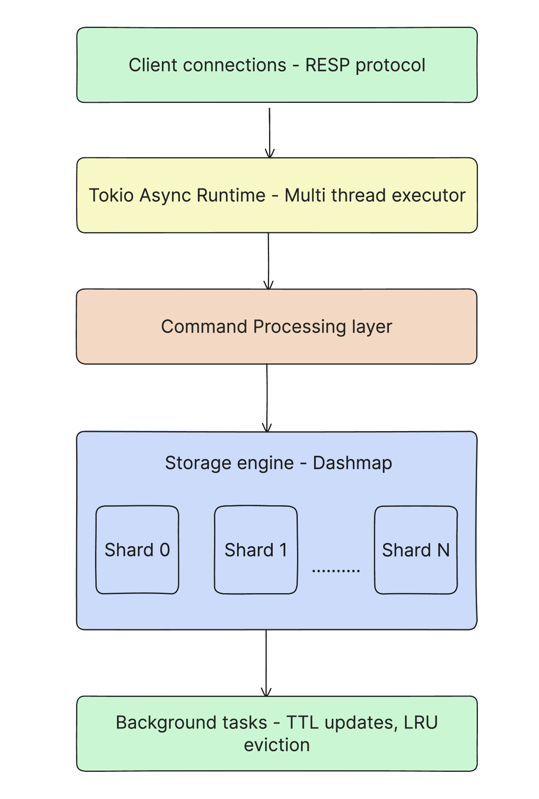

# Architecture & Design Philosophy

This document explains the design decisions, architecture, and trade-offs that make Redistill a high-performance Redis-compatible cache.

## Table of Contents

- [Design Philosophy](#design-philosophy)
- [Architecture Overview](#architecture-overview)
- [Performance Optimizations](#performance-optimizations)
- [Trade-offs](#trade-offs)
- [Use Cases](#use-cases)
- [When to Use Redistill vs Redis](#when-to-use-redistill-vs-redis)

## Design Philosophy

Redistill is built on a simple principle: **trade persistence for performance**. By eliminating the persistence layer entirely, Redistill can optimize for what matters most in a caching layer: speed, throughput, and low latency.

### Core Principles

1. **No Persistence** - Zero disk I/O overhead
2. **Multi-threaded** - Leverage all CPU cores
3. **Lock-free Reads** - Concurrent access without blocking
4. **Zero-copy** - Minimize memory allocations
5. **Production-ready** - Security, monitoring, and reliability built-in

## Architecture Overview



## Performance Optimizations

### 1. No Persistence Layer

**What Redis Does:**
- Writes to AOF (Append-Only File) on every write
- Periodic RDB snapshots
- fsync() calls for durability

**What Redistill Does:**
- Nothing. All data lives in memory only.

**Impact:**
- Eliminates all disk I/O
- No AOF rewriting overhead
- No fsync() blocking
- Simpler code path for writes
- Data lost on restart (by design)

### 2. Multi-threaded Architecture

**What Redis Does:**
- Single-threaded event loop
- All commands processed sequentially
- Background threads only for slow operations (BGSAVE, etc.)

**What Redistill Does:**
- Tokio multi-threaded runtime
- Concurrent command processing across all cores
- Work-stealing scheduler for load balancing

**Impact:**
- Utilizes all CPU cores
- Higher throughput under load
- Better resource utilization
- Slightly higher memory overhead for thread pools

### 3. Lock-free Reads with DashMap

**What Redis Does:**
- Single thread = no locks needed
- Linear access to hash table

**What Redistill Does:**
- DashMap: Concurrent hash map with fine-grained locking
- Multiple shards (default 2048) for reduced contention
- Read operations don't block each other

**Impact:**
- Concurrent GET operations scale linearly with cores
- Minimal contention on different keys
- Optimized for read-heavy workloads
- Slightly higher memory per shard

**Shard Count Impact:**
```
256 shards:   High contention, lower memory
2048 shards:  Optimal balance (Recommended)
4096 shards:  Maximum GET performance, higher memory
```

### 4. Zero-copy Design with Bytes

**What Redis Does:**
- String allocations for each value
- Memory copying on reads

**What Redistill Does:**
- Uses `Bytes` crate for reference-counted buffers
- Cheap cloning via reference counting
- No data copying on reads

**Impact:**
- Reduced memory allocations
- Faster reads (no memcpy)
- Lower GC pressure
- Better cache locality

### 5. Batched Writes

**What Redis Does:**
- Processes pipelined commands individually
- Atomic counters updated per operation

**What Redistill Does:**
- Batches operations internally
- Probabilistic LRU (90% skip rate)
- Batched counter updates (256x reduction in atomics)

**Impact:**
- Reduced atomic operation overhead
- Better CPU cache utilization
- Matches Redis performance at extreme concurrency
- LRU timestamps slightly less accurate (acceptable trade-off)

### 6. Async I/O with Tokio

**What Redis Does:**
- epoll/kqueue for event loop
- Custom networking code

**What Redistill Does:**
- Tokio for async networking
- Buffered I/O with connection pooling

**Impact:**
- Battle-tested async runtime
- Efficient syscall management
- Better error handling
- Future-proof (Tokio improvements benefit Redistill)

## Trade-offs

### What You Gain

| Feature | Benefit |
|---------|---------|
| **4.5x faster throughput** | More requests per server |
| **5x lower latency (p50)** | Better user experience |
| **Read-heavy optimization** | Perfect for caching workloads |
| **Multi-core utilization** | Better hardware efficiency |
| **Lower infrastructure cost** | 50-83% cost savings vs alternatives |

### What You Lose

| Feature | Impact | Mitigation |
|---------|--------|-----------|
| **Persistence** | Data lost on restart | Use as cache, not source of truth |
| **Replication** | No built-in HA | Use client-side sharding/proxy |
| **Clustering** | No automatic sharding | Manual sharding or proxy |
| **Complex data types** | Only strings | Fine for 90% of cache use cases |
| **Modules** | No Redis modules | Built-in features cover most needs |

### When Redistill Excels

**Read-heavy workloads** (70%+ reads)
- GET operations are 2-4x faster than Redis
- Lock-free reads scale with cores

**High concurrency** (50-300 clients)
- Multi-threaded architecture shines
- Better resource utilization

**Pipelined workloads** (P≥16)
- Batched operations reduce overhead
- Optimized buffer management

**Medium-large values** (256B-10KB)
- Zero-copy design benefits larger values
- Less overhead relative to data size

### When Redis is Better

**Need persistence**
- Redis has AOF/RDB
- Redistill loses data on restart

**Need replication/clustering**
- Redis has built-in clustering
- Redistill requires manual sharding

**Complex data structures**
- Redis supports Lists, Sets, Hashes, Sorted Sets
- Redistill only supports strings (KV pairs)

**Write-heavy extreme loads** (>50% writes, 500+ clients)
- Redis's single-threaded model can be faster at extreme write concurrency
- Redistill's multi-threading has coordination overhead

## Use Cases

### Perfect For

**1. HTTP Session Storage**
- Read-heavy (sessions read on every request)
- Ephemeral data (can regenerate from auth service)
- High throughput requirements
- TTL support built-in

**2. API Response Caching**
- 95%+ cache hit rates typical
- Database queries 50-150ms vs cache 1-2ms
- Can regenerate from database
- Perfect for read-heavy workloads

**3. Rate Limiting**
- Simple counters with TTL
- High write throughput needed
- Loss of counter on restart acceptable
- Sub-millisecond latency required

**4. Real-time Leaderboards**
- Frequent reads, periodic writes
- Can rebuild from database
- Performance critical for UX
- TTL for automatic cleanup

**5. Feature Flags**
- Read-heavy (checked on every request)
- Small data size
- Occasional updates
- Low latency critical

### Not Recommended For

**1. Primary Data Store**
- Reason: No persistence
- Alternative: Use PostgreSQL, MongoDB, etc.

**2. Financial Transactions**
- Reason: Data loss on restart unacceptable
- Alternative: Use ACID-compliant database

**3. Long-term Data Storage**
- Reason: In-memory only, data evicted
- Alternative: Use database or object storage

**4. Complex Queries**
- Reason: No secondary indexes, no filtering
- Alternative: Use database with proper indexing

## When to Use Redistill vs Redis

| Requirement | Redistill | Redis |
|-------------|-----------|-------|
| Maximum throughput | Best choice | Slower |
| Lowest latency | Best choice | Higher p50/p99 |
| Read-heavy workload (80%+ reads) | 2-4x faster | Slower |
| Write-heavy workload (>50% writes) | Good | Better at extreme scale |
| Need persistence | Not supported | AOF/RDB |
| Need replication | Not built-in | Built-in |
| Need clustering | Manual sharding | Redis Cluster |
| Complex data types | Strings only | Lists, Sets, Hashes, etc. |
| Drop-in Redis replacement | For caching | Check feature compatibility |
| Cost efficiency | 50-83% savings | Higher costs |
| Multi-core utilization | All cores | Single threaded |

## Technical Implementation Details

### Concurrency Model

```rust
// Simplified architecture concept

// DashMap provides concurrent access
let store = DashMap::new();

// Read operations (lock-free)
async fn handle_get(key: &str) -> Option<Bytes> {
    store.get(key).map(|entry| entry.value().clone())
}

// Write operations (fine-grained locking)
async fn handle_set(key: String, value: Bytes) {
    store.insert(key, value);
}

// Multiple concurrent reads don't block each other
// Writes only lock the specific shard containing the key
```

### Memory Management

```
Key anatomy in memory:
┌────────────────────────────────────────┐
│ Key (String)                           │  ~32-128 bytes
├────────────────────────────────────────┤
│ Value (Bytes - reference counted)      │  Variable
├────────────────────────────────────────┤
│ Timestamp (u64)                        │  8 bytes
├────────────────────────────────────────┤
│ TTL (Option<u64>)                      │  16 bytes
├────────────────────────────────────────┤
│ DashMap overhead                       │  ~32 bytes
└────────────────────────────────────────┘

Total overhead per key: ~100 bytes
```

### Eviction Strategy

**LRU (Least Recently Used):**
- Probabilistic updates (90% skip rate)
- Batched timestamp updates
- Background eviction task
- Configurable memory limit

**Algorithm:**
1. Check memory usage periodically
2. If > max_memory, select random samples
3. Evict keys with oldest timestamp
4. Continue until memory < max_memory

## Future Roadmap

### Planned Features

- [ ] **Clustering support** - Built-in sharding
- [ ] **Replication** - Master-slave replication
- [ ] **Snapshot support** - Optional persistence
- [ ] **Pub/Sub** - Message broadcasting
- [ ] **Lua scripting** - Custom commands
- [ ] **More data types** - Lists, Sets, Hashes

### Performance Improvements

- [ ] **DPDK support** - Kernel bypass networking
- [ ] **NUMA awareness** - Better multi-socket performance
- [ ] **jemalloc tuning** - Optimized allocator settings
- [ ] **CPU pinning** - Thread affinity for better cache locality

## Contributing

We welcome contributions! Areas that need help:

1. **Performance testing** - More real-world benchmarks
2. **Feature implementation** - See roadmap above
3. **Documentation** - Usage examples, tutorials
4. **Bug reports** - Edge cases, race conditions
5. **Client libraries** - Language-specific optimizations

## See Also

- [Benchmarks](BENCHMARKS.md) - Performance testing methodology
- [Performance Tuning Guide](PERFORMANCE_TUNING.md) - Optimization tips
- [Production Guide](PRODUCTION_GUIDE.md) - Deployment best practices
- [Configuration Reference](CONFIG.md) - All configuration options

